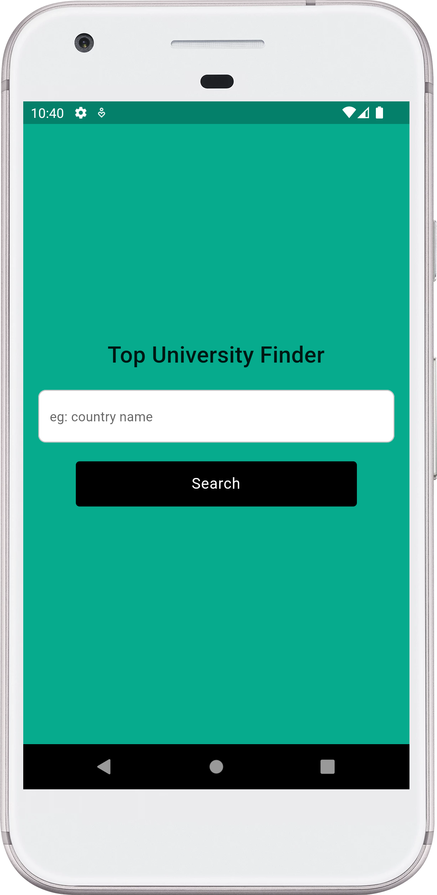
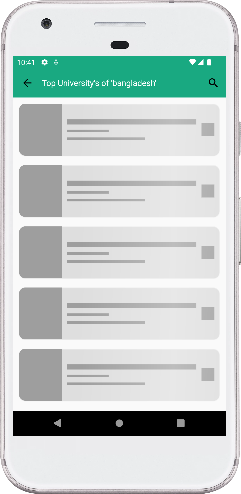
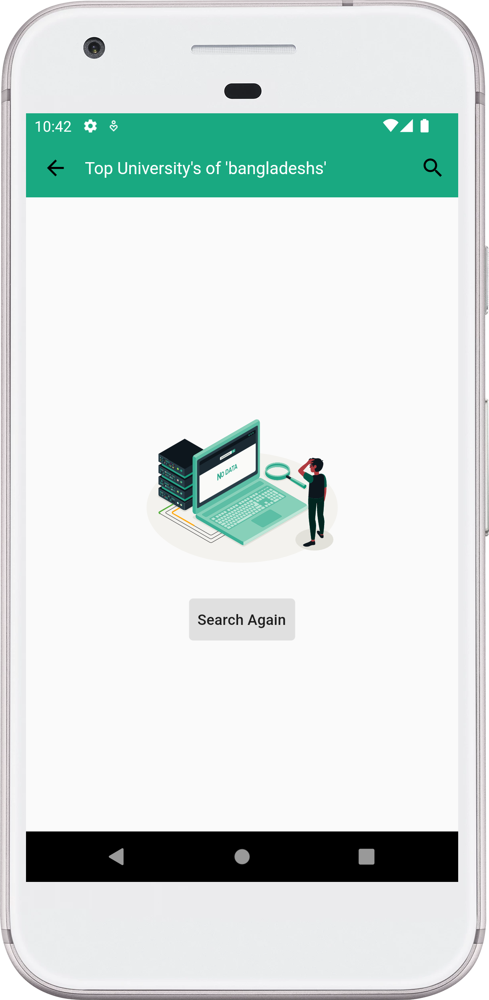
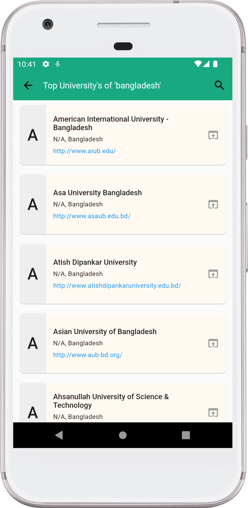
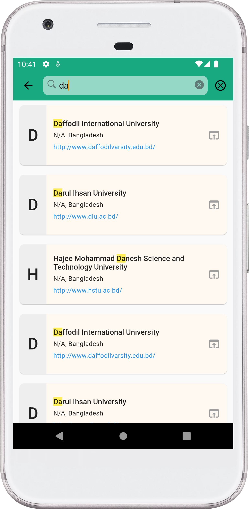

# University Info Finder

A Flutter Application to find all university in any country. In this app I have use `provider` for state management and `http` for fetch data from API.

## More Info

This a challenge app for `📝 TASK 2` in AppDev Cohort 1.0 workshop.

## 📱 App Description:
Create an app that allows users to type the name of a country and quickly fetch related information using an API. The app should display the fetched data in a user-friendly list view format.

## 🎯 Goal:
The key goal is to make the app easy for users to navigate and understand. When the user types in a parameter (eg: country name) and hits a button, the app should swiftly display useful information related to their input.

🔗 API Link: `http://universities.hipolabs.com/search?country=India`

**Packages we are using:**

- http
- google_fonts
- provider
- shimmer
- url_launcher
- lottie

**Code Credit**

- Code using Flutter with ❤️ by [Md. Al-Amin](https://github.com/alamin-karno)

## Animation (GIF):
|                 University Finder App (GIF)                  |
|:------------------------------------------------------------:|
|  |

## Screenshots:
|                           Search Screen                            |                        Loading Screen                         |                        No Data Screen                         |
|:------------------------------------------------------------------:|:-------------------------------------------------------------:|:-------------------------------------------------------------:|
|    |    |    |
|                            Home Screen                             |                      Home Search Screen                       |
|                 |     | 

### Repository Owner Info

### Md. Al-Amin
##### Junior Software Engineer (Android & iOS) at Rokomari.com

__Email :__ [ alamin.karno@outlook.com ](mailto:alamin.karno@outlook.com) \
__Github :__ [Md. Al-Amin](https://github.com/alamin-karno) \
__Facebook :__ [মোঃ আল-আমিন খন্দকার কর্ণ](https://facebook.com/alamin.kanro) \
__Linkedin :__ [Md. Al-Amin](https://www.linkedin.com/in/alaminkarno/)